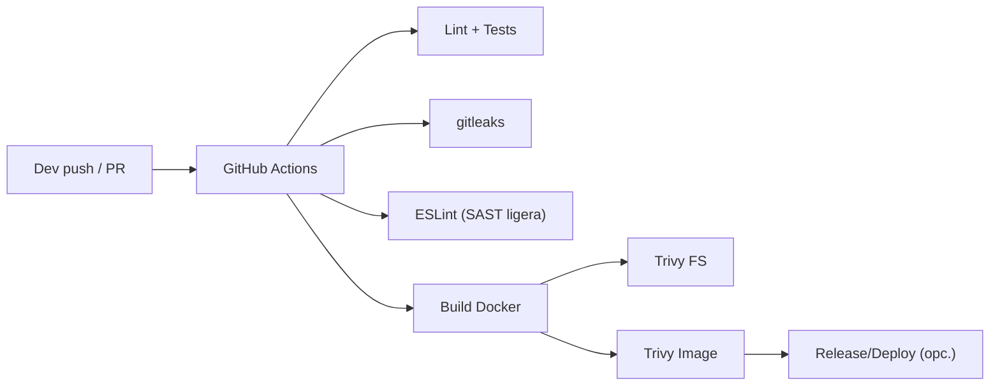

# 🔐 DevSecOps Zero Trust CI/CD Pipeline — Node.js + GitHub Actions

> Demostración **production‑ready** de una **pipeline segura** basada en principios **Zero Trust**, combinando automatización, controles de seguridad y calidad continua. Lista para usar en **GitHub Codespaces** o local.

<p align="left">
  
  
  
  
  
</p>

---

## 🎯 Objetivos

* Mostrar un **pipeline realista y reutilizable** de **DevSecOps**.
* Integrar **controles de seguridad automatizados** en el SDLC.
* Servir de base para proyectos **Cloud / SysOps / Seguridad**.

---

## ✨ Características principales

* 🔒 **Express API** endurecida: `helmet`, CSP, XSS protection, headers seguros.
* ⚙️ **CI/CD GitHub Actions**: build, test, lint y despliegue automatizado.
* 🕵️ **Secret scanning** con **gitleaks** (detecta llaves y tokens).
* 🛡️ **Container scanning** con **Trivy** (FS & image vuln scan).
* 🔍 **Static code analysis** con **ESLint** (calidad/buenas prácticas JS).
* 📜 **Zero Trust Policy**: checklist y documentación para adoptar ZT por capas.
* 💻 **Codespaces‑ready** y replicable en entornos locales.

---

## 🧭 Arquitectura de la pipeline



---

## 📂 Estructura (referencial)

```
.
├─ src/                 # Express API
├─ .github/workflows/
│  └─ ci.yml            # Pipeline CI/CD
├─ .eslintrc.cjs        # Reglas ESLint
├─ .gitleaks.toml       # Reglas de secretos (opcional)
├─ Dockerfile
├─ docker-compose.yml   # (opcional)
├─ package.json
├─ .dockerignore
├─ .gitignore
└─ README.md
```

> Los nombres pueden variar en tu repo. Esta guía es compatible con **Codespaces**.

---

## ⚙️ Requisitos

* **Node.js 20+**
* **Docker** (para escaneo de imagen y/o despliegue)
* GitHub Actions habilitado en el repositorio

---

## 🚀 Uso rápido

### Local

```bash
npm ci
npm run start
# API en: http://localhost:3000
```

### Codespaces

```bash
npm ci
npm run dev
```

### Quality & Security

```bash
npm run lint        # ESLint
npx gitleaks detect # Secret scanning (o usa el action de gitleaks)
npx trivy fs .      # FileSystem scan
# Para imagen Docker (si construyes imagen):
# docker build -t app:dev . && npx trivy image app:dev
```

---

## 🛠️ Scripts npm (ejemplo)

```json
{
  "scripts": {
    "start": "node src/server.js",
    "dev": "nodemon src/server.js",
    "lint": "eslint . --ext .js,.cjs --max-warnings=0",
    "test": "node -e \"console.log('TODO: add tests')\""
  }
}
```

---

## 🔐 Seguridad aplicada (Zero Trust by design)

* **Identidad y mínimos privilegios** en CI: permisos `contents: read`, `packages: read`, `id-token: write` sólo cuando aplique.
* **Separación de capas**: API, contenedor, código y secretos con controles independientes.
* **Validaciones automáticas** en cada **push/PR** (no depender de revisiones manuales).
* **Política CSP** y **headers** seguros (Helmet), disable `x-powered-by`, timeouts razonables.
* **Imágenes Docker** minimalistas + **Trivy** para CVEs.
* **Secret scanning** con reglas personalizables (`.gitleaks.toml`).

**Checklist Zero Trust (resumen)**

* [x] Lint + tests obligatorios en PR
* [x] Escaneo de secretos
* [x] Escaneo de vulnerabilidades en FS/imagen
* [x] Política de permisos mínimos en Actions
* [x] Build reproducible y dockerignore correcto
* [x] Dependabot / npm audit (sugerido)

---

## 🧪 CI/CD: workflow de ejemplo (`.github/workflows/ci.yml`)

```yaml
name: ci
on:
  push:
    branches: [ main ]
  pull_request:
    branches: [ main ]
permissions:
  contents: read
  security-events: write
concurrency:
  group: ${{ github.workflow }}-${{ github.ref }}
  cancel-in-progress: true
jobs:
  lint_test:
    runs-on: ubuntu-latest
    steps:
      - uses: actions/checkout@v4
      - uses: actions/setup-node@v4
        with:
          node-version: '20'
          cache: 'npm'
      - run: npm ci
      - run: npm run lint
      - run: npm test

  gitleaks:
    runs-on: ubuntu-latest
    steps:
      - uses: actions/checkout@v4
      - uses: gitleaks/gitleaks-action@v2
        with:
          args: detect --source . --no-git --redact --verbose

  trivy-fs:
    runs-on: ubuntu-latest
    steps:
      - uses: actions/checkout@v4
      - uses: aquasecurity/trivy-action@0.20.0
        with:
          scan-type: 'fs'
          scan-ref: '.'
          format: 'table'
          exit-code: '1'
          ignore-unfixed: true

  docker-build-and-scan:
    needs: [lint_test, gitleaks, trivy-fs]
    runs-on: ubuntu-latest
    steps:
      - uses: actions/checkout@v4
      - uses: docker/setup-buildx-action@v3
      - uses: docker/build-push-action@v6
        with:
          context: .
          load: true
          tags: app:ci
      - uses: aquasecurity/trivy-action@0.20.0
        with:
          image-ref: 'app:ci'
          format: 'table'
          exit-code: '1'
          ignore-unfixed: true
```

> Puedes añadir **CodeQL** como workflow aparte para SAST más profundo.

---

## 📜 Política Zero Trust (resumen)

* **Verificar explícitamente** cada request: auth fuerte (OIDC/JWT), autorización por recurso.
* **Asumir compromiso**: limitar alcance; segmentar entornos y redes.
* **Minimizar confianza**: secretos rotados y en gestores seguros; no hardcodear.
* **Telemetría**: logs estructurados, métricas y trazas para detección temprana.

---

## 🧯 Troubleshooting

* **Falsos positivos gitleaks** → agrega excepciones en `.gitleaks.toml` (hash/regex) y documenta el porqué.
* **Trivy falla por CVEs** → fija versiones base o usa `ignore-unfixed`, pero documenta el riesgo.
* **ESLint rompe build** → corrige reglas o ajusta severidad, nunca desactives sin motivo.
* **Permisos insuficientes** en Actions → revisa `permissions:` y `secrets` del repo/org.


## 📄 Licencia

**MIT** — Úsalo, modifícalo y distribúyelo citando la fuente.


## 👨‍💻 Autor

**© 2025 Emanuel** — Licencia **MIT**
**LinkedIn:** [https://www.linkedin.com/in/emanuel-gonzalez-michea/](https://www.linkedin.com/in/emanuel-gonzalez-michea/)

